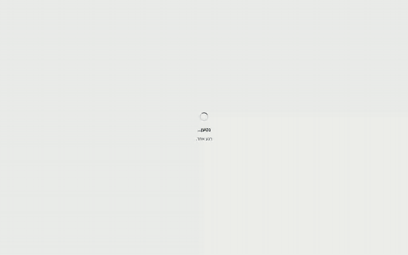
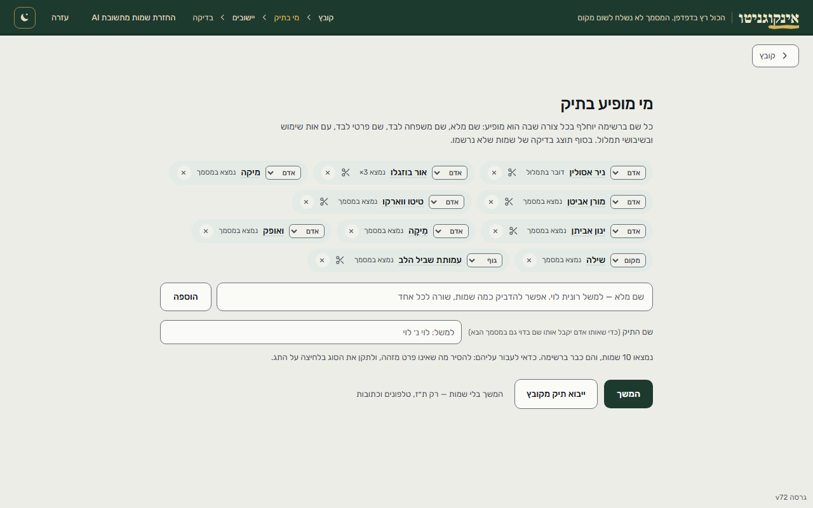
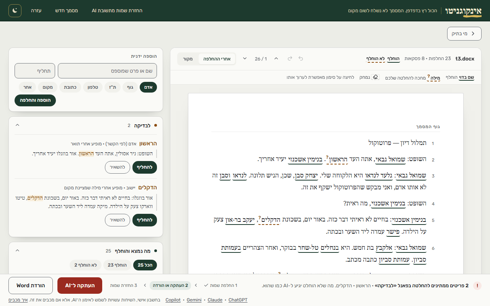
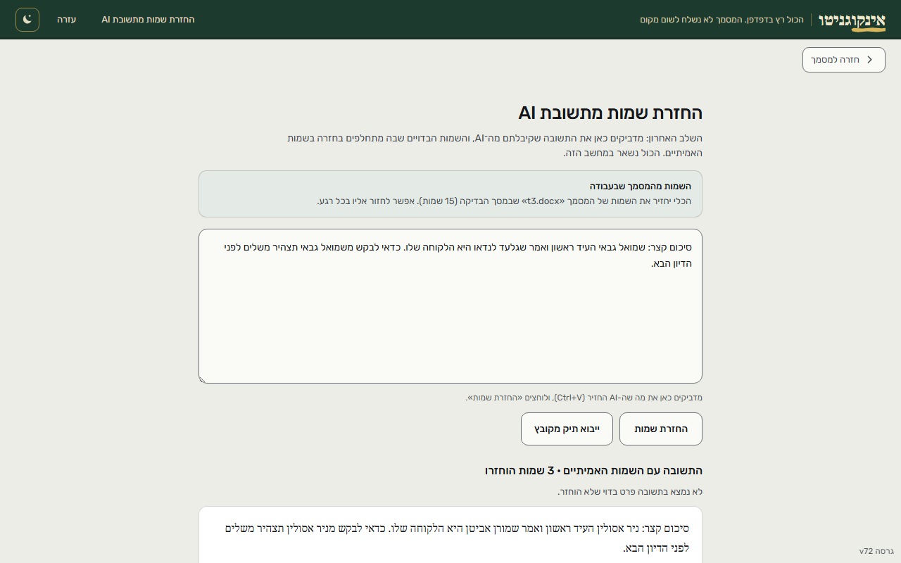

# paintItBlack

paintItBlack removes identifying details (people, places, organisations, ID and phone numbers) from Hebrew Word and PDF documents before they are pasted into an AI tool.
Each detail is replaced with a consistent substitute, and when the AI answers, the tool puts the real names back into the answer.
Everything runs in the browser. There is no server, and the document never leaves the computer.
It was built for a real client, a lawyer, and shaped by her feedback and her session logs, which record timings and clicks but never text.
The interface is in Hebrew; the Hebrew documentation follows this section.

**Live:** https://ombed.github.io/paintItBlack/ · **Demo (36 s):** [docs/demo/demo.mp4](docs/demo/demo.mp4), on an invented court transcript from the benchmark corpus

  

## How I know it works

- **Benchmark** ([bench/results.md](bench/results.md)): 43 invented documents with 332 keyed entities, built to cover the hard cases (prefix letters, nikud, transcription typos, look-alike surnames, names hidden in headers, footnotes and alt text). With the model on: 2 missed, 2 leaked, 5 false positives.
- It scores **the whole pipeline**, not the model alone: it runs the same chain as the page and checks the output file a user would send, so a leak in any layer counts.
- A **blocking CI gate** ([bench/gate.js](bench/gate.js)) runs the deterministic layers on every change and compares each entity with itself in the committed baseline; any entity that gets worse fails the build. The model-on run downloads the weights, so it is run by hand.
- **Model choice** ([docs/model-eval/](docs/model-eval/README.md)): 16 configurations of 9 local Hebrew models, with the decision rule written and committed before any run. Only one passed: DictaBERT-parse's NER head with a corrected tokenizer, which now ships.
- **A real document:** on a public Knesset committee transcript ([tests/protocol.txt](tests/protocol.txt), 1,431 words), the people list opens with 6 of the 10 participants the test checks, read from the header. Once the other four are typed in, all ten are found everywhere they appear, including two misspellings of one name, and two people nobody listed are flagged for review (`npm run report`).

## How it's built

- Vanilla JavaScript, no framework and no build step for the page; the engine is plain files concatenated into one script.
- Name recognition: the NER head of DictaBERT-parse, exported to ONNX, quantized to 8 bits and run in the browser with transformers.js. It is served from this site and checked against a pinned SHA-256 before use.
- Rules, Hebrew prefix handling and a gazetteer run alongside the model; the model only adds suggestions.
- Tests: about 3,000 Node checks and over 200 Playwright browser tests in CI, plus the benchmark gate above.
- Developed with Claude Code as the coding agent. The design decisions are mine, and I can explain each one.

---

# השחרת מסמכים

כלי להסרת פרטים מזהים ממסמכי Word לפני שליחה לכלי AI, ולהחזרת השמות
האמיתיים לתשובה. הזיהוי, ההחלפה והאימות רצים כולם בדפדפן — שום מסמך
לא נשלח לשרת, ואין שרת.

## פריסה

הקבצים יושבים יחד תחת אותה כתובת `https`:

| קובץ | תפקיד |
|---|---|
| `index.html` | הכלי — מבנה, עיצוב, ולוגיקת הממשק |
| `support.js` | שכבת ההרצה שמרנדרת את הממשק |
| `page-logic.js` | לוגיקת דף שאינה תלויה ב-DOM (דוח הדליפה); נבדקת גם ב-Node |
| `redact-engine.js` | מנוע ההשחרה: זיהוי, החלפה, אימות, DOCX |
| `pdf-text.js` | חילוץ טקסט מ-PDF |
| `text-to-docx.js` | הפיכת טקסט מודבק ל-docx לצורך העיבוד |
| `sw.js` | עובד שירות — התקנה ועבודה בלי רשת |
| `manifest.webmanifest` | הגדרות התקנה |
| `icon.svg`, `icon-192.png`, `icon-512.png` | אייקונים |
| `vendor/transformers-4.2.0.min.js` | ספריית מודל הזיהוי (transformers.js), מהאתר עצמו ולא מ-CDN |
| `vendor/ort-1.24.0-dev.20251116-b39e144322/ort-wasm-simd-threaded.asyncify.mjs`, `vendor/ort-1.24.0-dev.20251116-b39e144322/ort-wasm-simd-threaded.mjs` | הטוען של ספריית ההרצה; קובץ ה-WebAssembly שלה יורד מ-CDN ונבדק מול SHA-256 נעול |
| `vendor/pdfjs-4.6.82/pdf.min.mjs`, `vendor/pdfjs-4.6.82/pdf.worker.min.mjs` | pdf.js, לקריאת PDF |
| `models/dictabert-parse-ner-37f4d6f/config.json`, `models/dictabert-parse-ner-37f4d6f/tokenizer.json`, `models/dictabert-parse-ner-37f4d6f/tokenizer_config.json`, `models/dictabert-parse-ner-37f4d6f/special_tokens_map.json` | מודל הזיהוי (DictaBERT-parse של Dicta, CC BY 4.0): ההגדרות והטוקנייזר, כמו שהם |
| `models/dictabert-parse-ner-37f4d6f/onnx/model_quantized.onnx.part1`, `models/dictabert-parse-ner-37f4d6f/onnx/model_quantized.onnx.part2`, `models/dictabert-parse-ner-37f4d6f/onnx/model_quantized.onnx.part3`, `models/dictabert-parse-ner-37f4d6f/onnx/model_quantized.onnx.part4` | המשקולות (185MB) בארבעה חלקים; הדף מחבר אותם ובודק את הקובץ המחובר מול SHA-256 נעול |
| `models/dictabert-parse-ner-37f4d6f/NOTICE.md` | הקרדיט, הרישיון ומה שונה במודל |

רק הקבצים האלה מתפרסמים: `.github/workflows/pages.yml` בונה איתם תיקייה
(`node scripts/build-site.js`), מריץ עליה בדיקות דפדפן, ומפרסם אותה ב-GitHub
Pages בכל דחיפה ל-main. שאר המאגר — בדיקות, בנצ'מרק, `design/`, `docs/` — לא
מוגש. קובץ שהדף טוען חייב להיכנס לרשימה שבסקריפט, לטבלה הזאת ולבדיקה
`tests/site_t.js`, שמשווה ביניהן.

GitHub Pages או כל אירוח סטטי מספיק. **כתובת `https` היא דרישה, לא
המלצה:** מקובץ `file://` הדפדפן חוסם Cache API, IndexedDB ו-`import`
דינמי, ומודל הזיהוי העברי לא נטען בכלל. הכלי מזהה את המצב ואומר אותו.

## פיתוח

המנוע נערך כקבצים תחת `engine/` (מקטע לכל באנר) ומשורשר ל-`redact-engine.js`
ב-`npm run build:engine`; קובץ הקנבס `design/redact.dc.html` נגזר מ-`index.html`
ב-`npm run build:design`. שניהם נבדקים ב-`npm test`, אז עותק שהתיישן הוא
סוללה אדומה.

| פקודה | מה |
|---|---|
| `npm test` | לינט, סוללות Node, בדיקות דפדפן — רץ על כל PR ב-CI |
| `npm run lint` | ESLint: שם לא מוגדר, הכרזה כפולה, regex שבור |
| `npm run bump 14` | מקדם את ששת אתרי הגרסה יחד |
| `npm run bench` / `bench:nomodel` / `gate` | הבנצ'מרק (ראו `bench/README.md`) |
| `npm run report` | דוח פערים, התמלול האמיתי, זמנים |
| `node scripts/diff-runtime.js` | טביעת האצבע של `support.js` המוטמע, והשוואה לעותק חדש |

עובדים על ענף, לעולם לא ישר על main; כל קומיט משאיר את `npm test` ירוק;
כל פריסה מקדמת גרסה.

## עדכון גרסה

בכל פריסה לקדם את **ששת** המקומות יחד — ארבעה ב-`index.html`, אחד
ב-`sw.js` וטבלת ה-README — בפקודה אחת: `npm run bump <n>`. `tests/version_t.js`
מוודא שכולם מסכימים. הרשימה מלאה בכוונה: קל לתקן את שני המופעים הגלויים ולפספס
את שניים שיושבים בתוך הלוגיקה.

| קובץ | שורה | המחרוזת | תפקיד |
|---|---|---|---|
| `index.html` | 1147 | `
גרסה v59
` | השבב התחתון — מה שנראה על המסך |
| `index.html` | 133 | `console.log("… גרסה v59")` | שורת הפתיחה בקונסול |
| `index.html` | 171 | `if(served==="v59") return;` | **בדיקת ההשוואה** מול מה שהעובד מגיש |
| `index.html` | 173 | `el.innerHTML='גרסה v59 · …'` | תווית האזהרה שמוצגת כשיש פער |
| `sw.js` | 8 | `const V="hedact-v59";` | מפתח המטמון |

מספרי השורות נכונים לגרסה v59 והם עזר בלבד — לחפש את המחרוזת, לא לסמוך
על המספר.

**בדיקת ההשוואה (`if(served===…)`, השורה השלישית בטבלה) היא הכי קלה לפספוס, והפספוס שקט-למחצה.** אם השבב והקונסול
יעלו לגרסה החדשה וההשוואה תישאר על הישנה, האזהרה «רענון בלי מטמון»
תופיע בכל טעינה גם כשהכל תקין. כלומר בדיוק המנגנון שנועד להסגיר מטמון
ישן הופך לרעש קבוע, ומאותו רגע הוא כבר לא מסגיר כלום.

אם יישכח `sw.js`, השבב התחתון יציג את הגרסה הקודמת לצד «רענון בלי
מטמון» ויסגיר את הפער מעצמו. עובד השירות עובד רשת-קודם על קבצי הכלי,
כך שעדכון מגיע בטעינה הראשונה ולא בשנייה.

## מה נטען מהרשת

| מאיפה | מה | מתי |
|---|---|---|
| unpkg.com | d3, topojson | רק כשלוחצים «הצגת המפה», ואחר כך מהמטמון |
| cdn.jsdelivr.net | קובץ ה-WebAssembly של ספריית ההרצה (נבדק מול SHA-256), קובץ הגיאומטריה למפה | כשהמודל נטען לראשונה, ובפעם הראשונה שנפתח מסך המפה |
| fonts.googleapis.com | Rubik, Noto Serif Hebrew | בכל טעינה, ואחר כך מהמטמון |

מודל הזיהוי עצמו (185MB) יורד מהאתר, מ-`models/`, ולא מאתר אחר: פעם אחת, רק אם «מודל זיהוי
עברי מקומי» דלוק. איך נבחר, מה עוד נבדק ולמה: `docs/model-eval/README.md`, עם כל הנתונים.

אף אחת מהבקשות האלה לא מכילה דבר מהמסמך. ספריות ההרצה נטענות עם
`integrity`, כך שקובץ שהוחלף בצד ה-CDN לא ירוץ. הביקור הראשון דורש
חיבור; אחריו הכל יושב במטמון והכלי עובד גם בלי רשת.

## בדיקת קבלה

1. השבב התחתון מציג את הגרסה החדשה מיד אחרי פריסה, בלי לנקות מטמון
2. אין `{{ }}` על המסך — אף אחד מהם
3. «מודל זיהוי עברי מקומי» דלוק → גרירת docx → המודל יורד ומסיים בלי שגיאה
4. בקונסול: `טוקנייזר: … JSON תקין ✓` ואחריו שורת `זיהוי:`
5. רשימת «מי בתיק» מתמלאת בשמות מהמסמך
6. החלפת מסמך באמצע סריקה — שמות מהראשון לא נכנסים לשני
7. מ-`file://` מופיעה הודעה מסודרת
